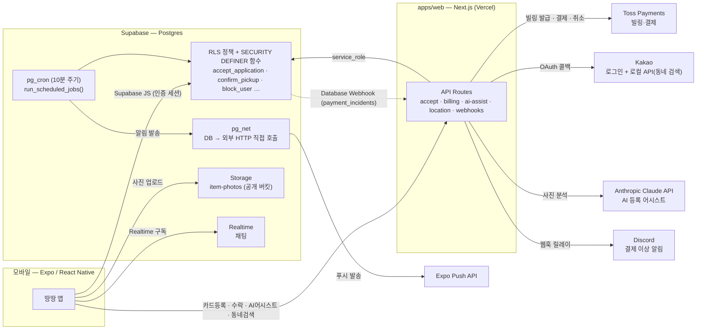

# 땅땅 (ttangttang)

**입찰은 지원서로, 확정은 땅땅.** 하이퍼로컬 중고나눔·소액거래 앱 — 무료나눔의 고질병(찜하고
잠수, 노쇼, 유세)을 "판매자가 갑인 지원서 기반 선택권 + 수락 즉시 자동결제(구속력)"로 없앤다.

- 웹: https://ttangttang-web.vercel.app
- 제품/아키텍처 스펙: [`PROJECT.md`](./PROJECT.md) — §0 핵심 규칙이 이 저장소의 헌법이다.
- 진행 상황·감사: [`CLAUDE.md`](./CLAUDE.md), [`docs/launch-audit.md`](./docs/launch-audit.md)
- 기술 결정 로그: [`docs/decisions.md`](./docs/decisions.md), [`docs/decisions/`](./docs/decisions/)

> 시연: <!-- TODO: 랜딩 페이지 시연 GIF — apps/web/app/page.tsx에 삽입 예정 (docs/store-listing.md 6단계 항목) -->

**현재 상태**: 개발 중이다. 웹(랜딩·약관·결제 콜백)은 배포돼 있지만, 앱은 아직 스토어에
없고 비공개 테스트도 시작 전이라 실사용자가 없다. 결제는 Toss 테스트 키로만 검증했고 —
실카드 승인은 [`docs/phone-check.md`](./docs/phone-check.md)의 실기기 확인이 남아 있다.
스토어 심사 전 남은 작업은 [`docs/launch-audit.md`](./docs/launch-audit.md) 진행 표를 보면 된다.

---

## 문제 정의

당근마켓류 무료나눔은 "선착순 채팅"이 기본 구조다. 여기서 세 가지 고질병이 나온다:

1. **찜하고 잠수** — 받겠다고 채팅해놓고 안 온다. 판매자는 다음 사람에게 다시 연락을 돌려야 한다.
2. **노쇼** — 약속 시간에 안 나타난다. 판매자의 시간과 기회비용은 전혀 보전되지 않는다.
3. **유세** — "저요 저요" 채팅이 쌓이면 판매자가 피곤해진다. 정작 받을 사람을 고르는 기준이 없다.

세 문제의 공통 원인은 하나다: **받겠다는 의사표시에 비용이 없다.** 채팅 한 줄 치는 데는
아무 구속력이 없으니, 안 지켜도 잃는 게 없다.

## 경매에서 지원서 모델로 전환한 이유

처음 설계(v1)는 실시간 입찰 경매였다 — 가격을 올려 부르는 사람이 낙찰. 그런데 이 구조는
무료나눔의 정서와 맞지 않았다("나눔인데 경매를?"), 그리고 더 치명적으로 **동시성 문제가
구매자 쪽에 있었다**: 여러 사람이 동시에 입찰가를 올리는 경쟁을 어떻게 원자적으로 처리할지가
껄끄러웠다.

v2(현재 구조)는 뒤집었다: **가격 경쟁이 아니라 판매자의 선택권**이 핵심이다.

- 시작가는 1,000 / 3,000 / 5,000원 셋 중 하나로 고정한다(§0 규칙 1) — 판매자는 가격을
  고민하지 않는다.
- 받고 싶은 사람은 "지원서"를 쓴다 — 제시가(시작가 이상 자유) + 방문 가능 시간 + 한 줄
  메시지. 지원은 무료지만 **카드 등록(빌링키)은 필수**다.
- 판매자는 지원서들을 보고 아무 때나 하나를 고른다. **수락하는 순간 그 지원자의 카드로 즉시
  결제된다.** 낙찰자는 취소할 수 없다.

이 구조가 좋아진 이유는 단순히 "느낌"이 아니라 **동시성의 임계 구간이 옮겨갔기 때문**이다.
v1은 "구매자들의 결제 경쟁"이 임계 구간이라 락 선점 같은 장치가 필요했다. v2는 그 구간이
**판매자의 단일 수락 행위**로 좁혀진다 — 남는 레이스는 "판매자 수락 vs 지원자 철회" 하나뿐이고,
이건 DB 트랜잭션 하나로 원자적으로 닫을 수 있다(아래 참고).

## 수락 원자성과 보상 트랜잭션

`POST /api/applications/:id/accept` 하나가 결제 체인 전체를 진행한다. 세 단계로 나뉜다.

```
1) DB 트랜잭션 (accept_application, 사용자 스코프)
   UPDATE applications SET status='accepted' WHERE id=:id AND status='pending'
   UPDATE items SET status='awarded' WHERE id=:item AND status='live'
   → 둘 중 하나라도 0 rows면 롤백 + 409 ("이 지원서는 방금 철회됐어요" 등)

2) 토스 빌링키 결제 실행 (외부 HTTP — DB 트랜잭션 안에 넣을 수 없다)

3) finalize_accepted_application() / revert_failed_acceptance() (service_role 전용)
```

문제는 2)가 DB 트랜잭션 밖에 있다는 것 — **"결제는 됐는데 확정이 실패"**, **"결제 결과를
모름"(타임아웃/네트워크 예외)** 같은 경우를 어떻게 처리할지가 실제 엔지니어링 난도였다.
초기 구현(Phase 3)은 이 부분이 비어 있었다 — 진단해서 8개 위험(P1~P8)을 찾고 보강했다:

| # | 위험 | 처리 |
|---|---|---|
| P1 | 결제 성공, 확정 실패 | 결제 취소(보상 트랜잭션) → 되돌림. 취소마저 실패하면 되돌리지 않고(이중 결제 방지) `payment_incidents`에 기록, 운영자 수동 처리로 넘김 |
| P2 | 결제 결과를 모름(타임아웃·예외) | "거절"로 단정하지 않고 `GET /v1/payments/orders/{orderId}`로 대조 — 있으면 확정 진행, 없으면 되돌림 |
| P4 | 멱등성 없음 | `Idempotency-Key: charge-{orderId}` / `cancel-{paymentKey}` |
| P5 | 카드 등록 대상 위조 가능 | 1회용 서버 세션(`billing_auth_sessions`)으로 카드 등록 대상을 로그인 사용자에 고정 + 오픈 리다이렉트 차단 |

전부 [`scripts/verify-stage3.mjs`](./scripts/verify-stage3.mjs)·[`scripts/e2e-flow.mjs`](./scripts/e2e-flow.mjs)가 모의 토스 서버(`scripts/lib/mock-toss.mjs`)로 성공·거절·예외·타임아웃 네 경로를 전부
재현해 검증한다 — 실카드 없이. 상세: [`docs/launch-audit.md`](./docs/launch-audit.md) §4,
[`docs/decisions.md`](./docs/decisions.md) 1단계.

## 권한 버그, 네 번 찾다

이 프로젝트에서 반복적으로 마주친 패턴이 있다 — "겉으로는 막힌 것 같은데 실제로는 뚫려있는"
권한 버그. 시기별로 네 번 찾았다.

**Phase 1 — 함수 권한 감사(초기 개발)**: 결제·낙찰을 확정하는 함수 두 개에서 미리 막았다.
1. `finalize_accepted_application()`/`revert_failed_acceptance()`는 Supabase 신규 함수의
   기본값(스키마 기본 권한으로 `anon`/`authenticated`에도 EXECUTE가 열림)이 그대로면,
   클라이언트가 가짜 `toss_payment_key`로 이 함수를 직접 호출해 **결제 없이 낙찰을 완료
   처리**할 수 있었다. `revoke ... from public, anon, authenticated`로 명시적으로 걷어냈다
   (`supabase/migrations/20260703084625_accept_atomicity.sql`).
2. `accept_application()`의 "판매자 본인 확인"에 흔한 부등호(`<>`)를 썼다면, `auth.uid()`가
   NULL인 익명 호출에서 그 비교 자체가 NULL이 되어 `IF`문이 통째로 스킵됐을 것이다 — 아무나
   아무 지원서나 수락할 수 있는 구멍. `IS DISTINCT FROM`(NULL-안전 비교)으로 막아뒀다.

**2026-09-27 — 출시 감사 → 1단계 보강**: 결제 체인의 보상 처리가 비어 있던 것(P1/P2/P5) —
위 "수락 원자성과 보상 트랜잭션" 참고.

**2026-09-28 — 3단계(신고·차단)**: RLS 서브쿼리가 caller의 RLS를 그대로 상속받는 버그
(아래 상세).

**2026-09-29 — 4단계(수령 확인)**: `item_status` enum에 `completed` 값이 있는데 그 값으로
전이시키는 코드가 어디에도 없어, 거래가 끝나도 매물이 영원히 `awarded`로 남아 있었다.
`confirm_pickup()`이 트랜잭션을 완료 처리하는 바로 그 순간에 같이 고쳤다
(`supabase/migrations/20260929000700_items_completed_on_pickup.sql`).

### RLS 버그 (3단계 상세)

3단계(신고·차단)에서 "차단하면 서로의 매물이 안 보인다"는 상호 비노출을 구현하다가 실제로
테스트가 잡아낸 버그는 하나다: **`items_select_public`이 `blocks`를 직접 서브쿼리로
참조**했다. bob이 alice를 차단하면, alice가 items를 조회할 때 그 정책 안의 `blocks`
서브쿼리도 **alice 자신의 RLS**(`blocks_select_own`: `blocker_id = auth.uid()`)를 그대로
적용받는다. bob이 만든 차단 행은 `blocker_id = bob`이라 alice의 시점에서는 그 서브쿼리 안에서
아예 안 보인다 — 결과적으로 차단이 **bob→alice 방향으로만** 걸리고 alice→bob 방향은 뚫려
있었다. `scripts/verify-stage3.mjs`의 상호 비노출 테스트가 이 비대칭을 직접 잡아냈다.
SECURITY DEFINER 함수 `is_blocked_pair()`로 고쳤다(이 저장소는 이미 `is_withdraw_restricted()`를
같은 이유로 SECURITY DEFINER로 만들어둔 선례가 있었는데도 처음엔 놓쳤다).

이 수정을 커밋하기 전에 코드 리뷰 과정에서 **같은 원인이 `applications_insert_own`에도 한 겹
더 있을 수 있다는 걸 미리 알아챘다** — 그 정책이 "item_id로 seller_id를 조회하는" 서브쿼리를
`is_blocked_pair()`를 꽂은 뒤에도 여전히 caller 권한으로 돌리고 있었다. 이미 차단된 상태라
그 매물 자체가 안 보이는 사용자가 옛 item_id로 직접 insert를 시도하면, seller_id 조회가
NULL이 되어 차단 검사 자체가 조용히 우회될 수 있었다. **이건 테스트가 실패해서 발견한 게
아니라, 첫 번째 버그를 고치며 "이 패턴이 또 있을 수 있다"는 걸 미리 의심하고 같은 커밋에서
선제적으로 닫은 것**이다 — items 조회까지 통째로 SECURITY DEFINER 안에 넣는
`is_applicant_blocked_from_item()`을 추가했고, 실제 테스트는 두 방어가 모두 들어간 최종본을
한 번에 통과했다(`supabase/migrations/20260928000300_block_enforcement_fix.sql`, 커밋
`1b6bcf0` 하나).

**"RLS 정책이 다른 RLS 테이블을 참조하면, 그 서브쿼리도 호출자의 RLS를 그대로 적용받는다"**가
공통 함정이다. `docs/decisions.md`에 "RLS 정책 작성 시 체크리스트: 서브쿼리가 참조하는
테이블도 자기 RLS의 영향을 받는지 확인"을 남겨 다음에 또 놓치지 않게 했다.

## 클라우드 백엔드 + 터널 기반 개발 환경 전환

Phase 3부터 결제(토스 빌링) 콜백을 실제 외부 서비스가 우리 서버로 리다이렉트해야 하는데,
로컬 Docker Supabase + LAN IP 조합이 이 네트워크 환경(VPN 어댑터만 잡히는 사설망)에서
안정적으로 동작하지 않았다. Supabase를 클라우드 프로젝트로, 웹은 (당시) ngrok, Expo 번들러는
`expo start --tunnel`로 전부 터널 기반으로 전환해 "이 PC의 정확한 LAN IP가 뭔가"라는 질문에서
완전히 자유로워졌다. 이후 `apps/web`을 Vercel에 실배포하면서 ngrok 의존은 제거했다(Expo
번들러 터널은 별개로 계속 필요). 상세: [`docs/decisions/dev-environment-cloud-and-tunnels.md`](./docs/decisions/dev-environment-cloud-and-tunnels.md).

무료 플랜 Supabase 프로젝트가 7일 무활동으로 자동 정지되는 것도 개발 중 실제로 겪은 뒤
[`.github/workflows/supabase-keepalive.yml`](./.github/workflows/supabase-keepalive.yml)로
막았다 — 자세한 환경 분리 절차(dev/e2e ↔ prod)는 [`docs/decisions/environment-separation.md`](./docs/decisions/environment-separation.md).

## 아키텍처



DB가 직접 외부 HTTP를 호출하는 두 지점(Discord 릴레이, Expo 푸시 발송)이 눈에 띄는데, 둘 다
같은 이유다 — 지원서/매물 변경이 전부 모바일에서 Supabase 클라이언트로 직접 일어나서 API
레이어를 거치지 않는다. 알림이 필요한 지점마다 트리거로 아웃박스에 적재하고, `pg_cron` +
`pg_net`이 10분마다 직접 발송한다(발사-후-망각, 델리버리 확인은 하지 않음 — 이 규모에서
재시도 큐까지 만드는 건 과설계라고 판단했다).

## 기술 스택

| 영역 | 선택 |
|---|---|
| 모바일 | Expo (React Native) + expo-router + NativeWind v4 |
| 웹 | Next.js App Router, Vercel 배포 |
| DB/Auth/Realtime/Storage | Supabase (Postgres + RLS + `pg_cron` + `pg_net`) |
| 결제 | Toss Payments 빌링(자동결제), `PaymentGateway` 인터페이스로 추상화 |
| AI | Anthropic Claude API — 사진 1장으로 등록 초안 제안(서버 전용, `tool_choice` 강제) |
| 위치 | Kakao 로컬 API — GPS 역지오코딩 + 검색 |
| 푸시 | Expo Notifications, DB에서 직접 발송 |
| 인프라 | GitHub Actions(Supabase keep-alive), pg_cron 스케줄 잡 |

## 테스트

스테이지별 회귀 검증 스크립트 — 전부 실제 dev Supabase 프로젝트를 상대로 돌고, 만든 데이터는
끝에 정리한다.

```
pnpm e2e             # 30개 스텝 — 등록→지원→수락(결제 4경로: 성공/거절/예외/타임아웃)→messages RLS
pnpm verify:stage3   # 20개 스텝 — 계정 삭제(소프트 삭제)·신고·차단(상호 비노출)
pnpm verify:stage4   # 33개 스텝 — 수령확인·노쇼정산·수령률·알림·AI 어시스트(실 API, 이상한 사진 3종 포함)
```

(2026-09-30 기준 통과 수. 세 스크립트 다 매번 새 throwaway 계정으로 돌고 끝에 만든 데이터를
정리한다 — 코드가 바뀌면 스텝 수도 바뀔 수 있다.)

## 화면 명세, 진행 상황

전체 화면 목록과 각 화면의 상태는 [`PROJECT.md`](./PROJECT.md) §6, 스테이지별 진행 상황과
남은 작업은 [`CLAUDE.md`](./CLAUDE.md)와 [`docs/launch-audit.md`](./docs/launch-audit.md)
진행 표에 있다.
